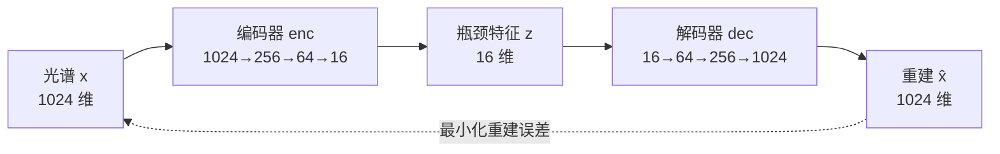

# 无监督学习（自编码器 + 异常检测 + 降维可视化）

本文档说明系统的无监督建模部分：自编码器（Autoencoder）的原理、涉及的每个
公式、以及训练页签每个参数的含义。

## 一、为什么用自编码器

近红外光谱是 1024 维的高维数据，且**没有标签**。自编码器用「把输入重建出来」
这个任务逼网络自己学到光谱的内在结构，是典型的无监督特征学习：



训练完成后，瓶颈层 16 维特征 `z` 就是光谱的低维表示，可用来做可视化与异常检测。

## 二、网络结构

| 层 | 维度 |
| --- | --- |
| 输入 | 1024 |
| 编码器 Linear+ReLU | 1024 → 256 |
| 编码器 Linear+ReLU | 256 → 64 |
| 编码器 Linear | 64 → 16（**瓶颈**）|
| 解码器 Linear+ReLU | 16 → 64 |
| 解码器 Linear+ReLU | 64 → 256 |
| 解码器 Linear | 256 → 1024 |

总参数量约 56 万（560,784），瓶颈维度默认可调（2~64）。

## 三、核心公式

### 1. 标准化（z-score，逐波长）

训练前对每个波长通道单独标准化，使各通道均值为 0、标准差为 1，避免大数值通道
主导损失：

$$\mu_j = \frac{1}{N}\sum_{i=1}^{N} x_{ij}, \qquad
\sigma_j = \sqrt{\frac{1}{N}\sum_{i=1}^{N}(x_{ij}-\mu_j)^2}$$

$$z_{ij} = \frac{x_{ij} - \mu_j}{\sigma_j + \varepsilon}\quad(\varepsilon=10^{-8}\text{ 防除零})$$

预测/微调时必须用**训练时保存的** $\mu_j,\sigma_j$，保证一致。

### 2. 重建与损失（均方误差 MSE）

设编码器为 $f$、解码器为 $g$，重建为 $\hat x = g(f(x))$。训练目标是最小化：

$$\mathcal{L} = \frac{1}{N}\sum_{i=1}^{N} \lVert x_i - \hat x_i \rVert^2
= \frac{1}{N d}\sum_{i=1}^{N}\sum_{j=1}^{d}(x_{ij}-\hat x_{ij})^2$$

其中 $d=1024$ 为光谱维数。优化器为 Adam。

### 3. 逐样本重构误差（异常检测依据）

训练收敛后，每个样本的重构误差衡量它「有多不像正常样本」：

$$e_i = \frac{1}{d}\sum_{j=1}^{d}(x_{ij} - \hat x_{ij})^2$$

正常样本重建得好（$e_i$ 小），异常/离群样本重建得差（$e_i$ 大）。

### 4. 异常阈值（分位数）

取重构误差的第 $p$ 百分位作为阈值：

$$t = \text{percentile}(\{e_i\},\ p)$$

$$\text{异常}(i) = e_i > t$$

默认 $p=99$，即误差最大的 1% 判为异常。$p$ 越大越严格。

### 5. PCA 降维（可视化）

把 16 维瓶颈特征投影到 2/3 维画散点图。PCA 通过 SVD 实现：

$$X_c = X - \bar X,\qquad X_c = U S V^\top$$

前 $k$ 维坐标为 $Z = X_c V_k^\top$，各主成分解释方差占比为：

$$\text{explained}_j = \frac{s_j^2}{\sum_l s_l^2}$$

「解释方差」越大，说明低维图保留的信息越多。

### 6. KMeans 聚类（离群剔除用，见《数据预处理》）

点到簇中心距离平方（利用展开避免大矩阵）：

$$d^2(x, c) = \lVert x\rVert^2 + \lVert c\rVert^2 - 2\,x\cdot c$$

## 四、训练参数含义

| 参数 | 含义 | 默认 | 调大/调小的影响 |
| --- | --- | --- | --- |
| 训练比例 | 训练集占比，其余做验证集 | 80% | 越小验证集越大、训练数据越少 |
| 训练轮数 | 遍历全部训练数据的次数 | 30 | 越大训得越充分，但可能过拟合 |
| 批大小 | 每次梯度更新用的样本数 | 256 | 越大越省时占显存，太小梯度噪声大 |
| 学习率 | Adam 更新步长 | 0.001 | 太大不收敛，太小收敛慢 |
| 瓶颈维度 | 压缩到的特征维度 | 16 | 越大信息越多，太小丢失细节 |
| 训练设备 | 自动/CPU/GPU | 自动 | GPU 显著加速 |
| 重建对比样本数 | 训练后重建对比图中误差最大的样本数量 | 3 | 越大看的样本越多 |
| 数据预处理 | SNV/MSC/S-G/导数开关 | 关闭 | 见《数据预处理》 |
| 离群剔除 | 训练前聚类剔除开关 | 关闭 | 见《数据预处理》 |

## 五、三种输出

| 输出 | 公式/方法 | 用途 |
| --- | --- | --- |
| 模型文件 | 网络权重 + 标准化参数 | 供预测/可视化/微调复用 |
| 重构误差 | $e_i$ | 异常检测 |
| 瓶颈特征 | $z_i = f(x_i)$ | PCA 可视化、微调输入 |

## 六、MAE 遮蔽自编码（已实现，校验后未采用）

`model/autoencoder.py` 另提供 `train_mae`：MAE（Masked Autoencoder）自监督训练。
每个 batch 随机把 `mask_ratio` 比例的波长置 0（mask 掉），让模型用其余波长重建
被遮掉的波长，损失只计算被 mask 位置的 MSE，迫使模型学习波长间相关性而非
直接拷贝输入。

```python
from model.autoencoder import train_mae
# model: Autoencoder；X/Xva 为 z-score 后的光谱矩阵
hist = train_mae(model, X, epochs=30, batch_size=256, lr=1e-3,
                 mask_ratio=0.2, val_X=Xva, device=device)
```

**校验结论（2026-09-29）：不采用。** 与完整重建 AE 对比（预训练 epochs=30、
smooth+msc，微调 data-pr 2176、epochs=300、解冻 150、5 折 CV）：

| 预训练方式 | 微调验证 R² | CV R² | CV RMSE |
| --- | --- | --- | --- |
| 完整重建 AE | 0.6964 | 0.7227 ±0.035 | 0.6674 |
| MAE（mask 20%） | 0.6571 | 0.6679 ±0.037 | 0.7309 |
| MAE（mask 50%） | 0.6087 | 0.6586 ±0.014 | 0.7420 |

两种 mask 比例均比完整重建 AE 更差，且 mask 越高越差（CV R² 0.723 → 0.668 →
0.659）。原因：NIR 光谱高度平滑、相邻波长强相关，被 mask 的波长几乎可凭
周围波长线性插值补上，MAE 强制学习反而弱化了瓶颈层对完整光谱整体结构的
表征。故保留 `train_mae` 函数备选，未接入界面。
