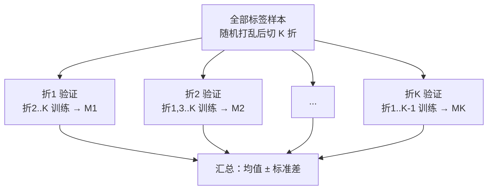

# 模型微调

## 用途

在已预训练的自编码器基础上，用**有标签数据**做有监督微调，让模型学会从光谱预测
指标（如糖度）。这是迁移学习：复用无监督预训练学到的光谱特征，再针对具体指标
训练一个回归头。

## 原理


- **冻结编码器**（默认）：只训练回归头，编码器权重不变。适合**少量标签数据**，防过拟合。
- **解冻编码器**：编码器与回归头一起微调，特征会向预测任务调整。适合标签数据较多时。
- **两阶段微调**（推荐）：先冻结训回归头若干轮（预热），再解冻编码器用较小学习率
  联合微调若干轮。兼顾稳定性与精度，通常效果最好。

微调内部细节：标签做 z-score 标准化（预测时自动反变换），回归头带 Dropout，
优化器带权重衰减，解冻微调时一并保存编码器权重。

**输入光谱标准化**：微调/预测时，光谱用**数据自身的 mean/std 做 z-score**（而非
复用预训练的 mean/std），以抵消预训练与标签两批数据之间的批次强度偏移；预测时
同样用预测数据自身的 mean/std，保持训练/预测一致。

## 核心公式

### 1. 回归头（MLP）

以预训练编码器 $f$ 提取瓶颈特征 $z=f(x)\in\mathbb{R}^{16}$，回归头把 $z$ 映射到
标量标签：

$$\hat y = W_3\,\mathrm{ReLU}\big(W_2\,\mathrm{ReLU}(W_1 z + b_1)+b_2\big)+b_3$$

结构为 $16 \to 32 \to 32 \to 1$，两层中间各接 ReLU 与 Dropout。

### 2. 标签标准化与反变换

训练时把标签做 z-score 标准化，使损失尺度与标签量纲无关：

$$\tilde y = \frac{y - \mu_y}{\sigma_y}, \qquad \mu_y=\bar y,\ \sigma_y=\mathrm{std}(y)$$

预测时反变换回真实尺度：

$$\hat y = \tilde{\hat y}\cdot\sigma_y + \mu_y$$

### 3. 损失（均方误差）

$$\mathcal{L} = \frac{1}{N}\sum_{i=1}^{N}(\hat{\tilde y}_i - \tilde y_i)^2$$

### 4. 评估指标（全部在真实尺度计算）

| 指标 | 公式 | 含义 |
| --- | --- | --- |
| RMSE | $\sqrt{\frac{1}{N}\sum_i(y_i-\hat y_i)^2}$ | 均方根误差，越小越好 |
| MAE | $\frac{1}{N}\sum_i\lvert y_i-\hat y_i\rvert$ | 平均绝对误差，对离群不敏感 |
| R² | $1-\dfrac{\sum_i(y_i-\hat y_i)^2}{\sum_i(y_i-\bar y)^2}$ | 决定系数，越接近 1 越好，0 相当于瞎猜 |
| 相关系数 | $\dfrac{\sum_i(y_i-\bar y)(\hat y_i-\bar{\hat y})}{\sqrt{\sum_i(y_i-\bar y)^2\sum_i(\hat y_i-\bar{\hat y})^2}}$ | 线性相关强度，[-1,1] |
| MAPE | $\dfrac{100}{N}\sum_i\left\lvert\dfrac{y_i-\hat y_i}{y_i}\right\rvert$ | 平均绝对百分比误差（%） |
| 偏差 bias | $\frac{1}{N}\sum_i(\hat y_i - y_i)$ | 平均系统性偏差，0 为无偏 |
| 误差标准差 | $\sqrt{\frac{1}{N}\sum_i(e_i-\bar e)^2},\ e_i=\hat y_i-y_i$ | 误差的波动幅度，越小越稳定 |
| 误差分位数 | $P_5,\ P_{95}$（误差的 5%/95% 分位数） | 90% 的误差落在 $[P_5,\ P_{95}]$ 区间 |
| ±0.5 度内占比 | $\frac{1}{N}\sum_i\mathbf{1}[\lvert e_i\rvert\le 0.5]$ | 误差绝对值不超过 0.5 度的样本比例 |
| ±1 度内占比 | $\frac{1}{N}\sum_i\mathbf{1}[\lvert e_i\rvert\le 1.0]$ | 误差绝对值不超过 1 度的样本比例 |

**各指标详细解释**：

- **RMSE（均方根误差）**：量纲与标签相同（预测糖度时，RMSE 的单位就是糖度值）。
  因为先平方再开方，**大误差被放大惩罚**，对少数预测偏差很大的样本敏感。它是最
  常用的综合精度指标。
- **MAE（平均绝对误差）**：量纲同标签，比 RMSE 更直观——「平均差多少」。对离群
  不敏感，通常 $MAE \le RMSE$，两者差越大说明离群误差越多。
- **R²（决定系数）**：模型解释了标签方差的比例。$R^2=1$ 完美预测；$R^2=0$ 相当于
  始终猜均值（瞎猜）；$R^2<0$ 比瞎猜还差。一般经验：$R^2>0.5$ 有实用价值，
  $0.7$ 以上较好（弱相关指标如糖度，0.6~0.7 已不错）。
- **相关系数**：预测值与真实值的线性相关程度，$[-1,1]$，越接近 1 越好。简单线性
  回归时 $R^2 = r^2$，但非线性回归两者不严格等价。
- **MAPE（平均绝对百分比误差）**：相对误差，便于跨量纲比较。缺点：真实值接近 0
  时数值会爆炸，只对非零标签有意义。
- **偏差 bias**：误差的平均值（预测 $-$ 真实）。正偏=系统性高估、负偏=系统性低估、
  0=无系统偏差。残差图（见预测评估）就是看这个指标随真实值的分布。
- **误差标准差（err_std）**：误差 $e_i=\hat y_i-y_i$ 的标准差，衡量「预测误差的
  波动有多大」。$err\_std$ 越大说明模型对一部分样本预测偏得厉害。它与 bias 一起
  刻画误差分布：bias 描述误差的「中心位置」，err_std 描述误差的「离散程度」。
- **误差分位数（err_p5 / err_p95）**：把每个样本的误差从小到大排序，取第 5% 和
  第 95% 位置的值。含义是「90% 的样本误差落在 $[P_5,\ P_{95}]$ 这个区间内」。
  例如 $[\,-0.8,\ +0.7\,]$ 表示绝大多数预测偏差在 ±0.8 以内，比 RMSE 更直观地
  给出「典型误差范围」。若 $P_5$ 与 $P_{95}$ 离得很开，说明存在少数误差极大的样本。
- **训练/验证损失（train_loss / val_loss）**：训练过程记录的**标准化尺度** MSE
  （见第 3 节，标签已 z-score 化）。它和 RMSE 的区别：损失在「标准化标签」上算
  （无量纲），RMSE 在「还原后的真实糖度」上算（量纲=糖度）。两者趋势一致，但
  数值不可直接比较。val_loss 是训练曲线里那条「验证损失」。
- **±0.5 度 / ±1 度内占比（within_0p5 / within_1p0）**：误差绝对值不超过
  0.5 度（或 1 度）的样本比例，是最直观的「有多少预测够准」：例如 ±0.5 度内
  88.8% 表示约九成样本预测误差在半度糖度以内，±1 度内 99.2% 表示几乎全部样本
  误差在一度以内。

**指标之间的关系（避免误解）**：

| 关系 | 说明 |
| --- | --- |
| MAE ≤ RMSE | 恒成立；两者差距越大，说明少数大误差（离群误差）越多 |
| R² vs 相关系数 | 线性拟合时 $R^2 = r^2$；本项目回归头是非线性的，两者不严格等价，都看更全面 |
| bias 与 RMSE | RMSE 同时受 bias（系统偏差）和 err_std（随机波动）影响：$RMSE^2 \approx bias^2 + err\_std^2$ |
| MAPE 与真实值 | 真实值越接近 0，MAPE 越不稳定，只对「糖度」这类远离 0 的标签有意义 |

**如何用这些指标判断模型好坏（结合本项目实际）**：

糖度标签本身：均值 11.5、标准差 1.15（范围 7.5~15.8）。据此：

| 判断 | 依据 |
| --- | --- |
| 预测有效 | RMSE 明显小于标签标准差（如 0.55 < 1.15），说明比「猜均值」准得多 |
| 无系统偏差 | bias 接近 0，残差图围绕 0 随机分布 |
| 精度较好 | R² ≈ 0.65~0.77、相关系数 ≈ 0.89、MAPE ≈ 4% |
| 误差范围 | 90% 的误差落在误差 5%~95% 分位区间内（如 ±1.0） |

### 5. 两阶段微调

设总轮数 $E$，解冻轮数 $U$（默认 $E=100,\ U=30$）：

- **阶段 1**（前 $E-U$ 轮）：冻结编码器，只更新回归头，学习率 $lr$；
- **阶段 2**（后 $U$ 轮）：解冻编码器，更新回归头 + 编码器，学习率 $lr\times0.1$。

第一阶段先把回归头预热到合理状态，第二阶段再小幅调整编码器特征，兼顾稳定性与精度。

### 6. K 折交叉验证（Cross-Validation）

#### 6.1 为什么需要 K 折

单次「随机 80% 训练 / 20% 验证」的划分带有偶然性：换一次随机划分，验证指标可能
明显波动（本项目早期曾出现同配置两次运行 R² 相差约 0.02）。当标签数据少（本项目
1596 个）时，这种波动更明显——某一次划分可能恰好「运气好」或「运气差」。

K 折交叉验证让**每个样本都恰好做一次验证**，用轮换的方式把数据充分用起来，得到
比单次划分更可靠的精度估计。

#### 6.2 流程（K=5 为例）

1. **随机打乱**全部样本（本项目固定随机种子 `0`，保证每次运行结果可复现）；
2. 切成 $K$ 个大小接近的子集，称为「折」（`np.array_split`，末折可能略少几个）；
3. 对第 $k$ 折（$k=1,2,\dots,K$）：
   - 用**其余 $K-1$ 折**做训练集，训练模型；
   - 在第 $k$ 折上验证，算出一组指标 $M_k$（RMSE、MAE、R²、相关系数、bias）；
4. 汇总 $K$ 次结果，报告**均值 ± 标准差**：

$$\bar M = \frac{1}{K}\sum_{k=1}^{K} M_k, \qquad
\sigma_M = \sqrt{\frac{1}{K}\sum_{k=1}^{K}(M_k - \bar M)^2}$$



> **本项目实现细节**（`model/service.py` 的 `_cross_validate`）：每一折都**从预训练
> 编码器的原始权重重新开始**（`load_state_dict(original_state)`），重新训练一个全新
> 的回归头——各折之间互不污染。因此 K 折相当于「独立训练并验证 K 次」，汇总结果
> 是对「换一个数据划分」的稳健估计。

#### 6.3 结果怎么读

以最新最佳模型为例（`cv` 里的实际数值）：

| 输出 | 含义 | 示例 |
| --- | --- | --- |
| `cv.k` | 折数 | 5 |
| `cv.folds` | 每一折的具体指标（5 个） | 第 1 折 R²=0.82、第 2 折 0.80… |
| `cv.mean` | K 次指标的平均值（= 上面的 $\bar M$） | R²=0.820，RMSE=0.484 |
| `cv.std` | K 次指标的标准差（= 上面的 $\sigma_M$） | R²±0.032，RMSE±0.027 |

- **均值**：比单次划分更可靠的平均精度，是**比较不同配置（解冻轮数、学习率等）
  时最该看的数字**。
- **标准差**：衡量模型对「数据怎么切」有多敏感。$\sigma$ 越小越稳。例如
  CV R² = $0.820 \pm 0.032$，意味着换一种划分，R² 大概率落在 0.79~0.85 之间。
- **fold 列表**：对比最差折与最好折，能发现是否存在「某些样本特别难/特别容易」。

#### 6.4 与「最终验证集」的区别

微调完成后页签同时展示两组指标，别混淆：

| | 最终验证集 `final_val_metrics` | K 折交叉验证 `cv` |
| --- | --- | --- |
| 划分 | 一次 80/20 划分（训练 1276 / 验证 320） | K 次轮换（每折验证约 320） |
| 训练次数 | 只训 1 次，得到最终交付模型 | 额外训 K 次（每折独立回归头） |
| 用途 | 展示**交付模型**在留出集上的表现 | 稳健估计**泛化精度**、比较不同配置 |
| 指标 | RMSE/MAE/R²/corr/bias + 训练/验证损失 | RMSE/MAE/R²/corr/bias 的均值±标准差 |

> 注意：CV 每折只用 `regression_metrics`（5 个指标，**不含 MAPE**）；MAPE、误差
> 标准差、误差分位数这些扩展指标在「预测评估」页签对整批数据一次性计算。

#### 6.5 K 的取值建议

| K | 特点 | 适用 |
| --- | --- | --- |
| 0（关闭） | 不做交叉验证，只训 1 次 | 快速试参数、赶时间 |
| 5（默认） | 每折验证约 20%、训练约 80%，性价比高 | 常规评估 |
| 10 | 估计更稳，但训练时间翻倍 | 样本很少、要求高可信度时 |

## 标签字段

> ⚠️ **重要**：当前数据集里**只有 1024 维光谱字段 `SpectrumData` 是有效数据**，
> 其余字段（`PredictedValue`、`Abs` 等）不可信、不可用作标签。微调需要**另行
> 提供带真实标签的数据**（例如人工检测的糖度值），按样本编号与光谱对齐后存入
> parquet 的一个新列，再在微调页签指定该列。

`parse_label` 支持两种标签格式：
- **单列数值**：整列就是一个数（如 `0` 分量位置的直接数值列）。
- **逗号分隔分量**：列值为 `a,b,c,...`，用「分量」参数取第几个（从 1 起）。

## 参数

| 参数 | 含义 | 默认值 |
| --- | --- | --- |
| 数据文件 | 含光谱与标签的 parquet | — |
| 预训练模型 | 自监督训练输出的模型目录 | — |
| 微调输出目录 | 保存微调结果的目录（自动建时间戳子目录） | — |
| 标签字段 | 标签所在列 | `PredictedValue` |
| 分量 | 标签字段第几个逗号分量（从 1 起） | 1（糖度） |
| 训练轮数 | 遍历训练集的次数 | 100 |
| 批大小 | 每次更新用的样本数 | 64 |
| 学习率 | 权重更新步长 | 0.001 |
| 训练比例 | 训练/验证集划分 | 80% |
| 微调样本数 | 参与微调的样本数，0 = 全部 | 0（全部） |
| 交叉验证折数 | K 折交叉验证，0 = 关闭 | 5 |
| 冻结编码器 | 勾选=先只训回归头，取消=全程解冻微调 | 勾选 |
| 解冻轮数 | 勾选冻结时，最后 N 轮解冻编码器联合微调，0 = 纯冻结 | 30 |
| 解冻学习率 | 解冻阶段编码器+回归头的优化器学习率，0 = 自动取学习率×0.1 | 0.0001 |
| 训练设备 | 自动 / CPU / GPU | 自动 |

## 用法

1. 先在「自监督预训练」页签训练出自编码器模型。
2. 准备一份带真实标签的数据（含 1024 维光谱列 + 标签列，按样本对齐）。
3. 进入「模型微调」页签，选择数据文件与预训练模型目录，指定标签字段与分量。
4. 按需设置交叉验证折数（K 折交叉验证会额外训练 K 次回归头，更稳健地估计精度）。
5. 点击「开始微调」，观察进度条与损失曲线。
6. 完成后展示验证集 **RMSE / MAE / R² / 相关系数** 与交叉验证汇总，模型与指标保存到微调输出目录。

## 预测评估

微调完成后，可在页签下方「用微调模型预测并评估」区域：

1. 微调模型目录（微调完成后自动填入）与数据文件（含真实标签）。
2. 点击「预测并评估」：模型对数据预测，同时读取真实标签计算指标。
3. 结果包括：
   - **指标**：RMSE、MAE、R²、相关系数、MAPE、偏差、误差标准差与 5%~95% 分位
   - **散点图**：预测值 vs 真实值（带 y=x 理想线），越贴近对角线越好
   - **CSV 输出**：`predict/YYYYMMDD_HHMMSS_finetune/predictions.csv`，含预测值、真实值、误差三列
   - **可视化图**：散点图、残差图、误差分布图自动保存为 `scatter_pred_vs_true.png`、
     `residual.png`、`error_histogram.png`，与 CSV 同目录

## 输出

微调输出目录（`finetune_output/YYYYMMDD_HHMMSS/`）包含：

| 文件 | 内容 |
| --- | --- |
| `finetune_head.pt` | 回归头权重 |
| `finetune_meta.json` | 标签字段/分量、是否冻结、头维度 |
| `base_model.json` | 原始预训练模型目录引用 |
| `spectrum_column.json` / `preprocess.json` | 复用训练时的字段与预处理 |
| `metrics.json` | **评估指标**：训练配置、标签统计、最终验证指标、交叉验证结果 |
| `loss_curve.png` | 微调损失与验证 R² 曲线图（自动保存） |

`metrics.json` 结构（以最新最佳模型 `20260928_155916` 为例）：

```json
{
  "config": {
    "label_column": "RealValue", "label_index": 0, "freeze": true,
    "epochs": 300, "batch_size": 64, "lr": 0.001, "train_ratio": 0.8,
    "k_folds": 5, "unfreeze_epochs": 100, "unfreeze_lr": null,
    "weight_decay": 0.0, "dropout": 0.2, "bottleneck": 16,
    "device": "cuda", "base_model_dir": "...", "spectrum_column": "SpectrumData",
    "preprocess": { "smooth": true, "msc": true }
  },
  "label_stats": { "n": 1596, "mean": 11.49, "std": 1.149, "min": 7.5, "max": 15.8 },
  "final_val_metrics": {
    "n_train": 1276, "n_val": 320,
    "rmse": 0.466, "mae": 0.362, "r2": 0.837, "corr": 0.920, "bias": -0.01,
    "train_loss": 0.23, "val_loss": 0.21
  },
  "cv": {
    "k": 5,
    "folds": [
      { "rmse": 0.49, "mae": 0.38, "r2": 0.82, "corr": 0.91, "bias": 0.01 },
      { "rmse": 0.50, "mae": 0.39, "r2": 0.80, "corr": 0.90, "bias": -0.10 },
      "... 共 k 个 ..."
    ],
    "mean": { "rmse": 0.484, "mae": 0.378, "r2": 0.820, "corr": 0.909, "bias": -0.04 },
    "std":  { "rmse": 0.027, "mae": 0.018, "r2": 0.032, "corr": 0.011, "bias": 0.11 }
  }
}
```

各字段含义：

| 字段 | 含义 |
| --- | --- |
| `config` | 本次微调的完整配置（标签字段/分量、是否冻结、轮数、批大小、学习率、训练比例、折数、解冻轮数与学习率、权重衰减、Dropout、瓶颈维度、设备、基础模型、光谱字段、预处理），便于复现 |
| `label_stats` | 标签的统计：样本数 n、均值、标准差、最小/最大值。其中 std 是判断「RMSE 是否够小」的参照（RMSE 明显小于 std 才说明预测有效） |
| `final_val_metrics` | 交付模型在留出验证集（20%）上的表现：RMSE/MAE/R²/corr/bias + 训练/验证损失 |
| `cv.k` | 交叉验证折数 |
| `cv.folds` | 每一折的具体指标（RMSE/MAE/R²/corr/bias），共 k 个 |
| `cv.mean` | K 折指标的均值（比单次更可靠的精度估计） |
| `cv.std` | K 折指标的标准差（越小越稳） |

## 预期效果与注意事项

- **依赖真实标签**：微调效果取决于标签数据质量；标签错误或噪声大，模型学到的就是
  噪声，R² 会很低甚至为负。
- **少量数据学不好是正常的**：只用几百个样本时 R² 可能为负（比瞎猜还差），建议
  标签样本尽量多，并给足训练轮数。
- **冻结 vs 解冻**：样本很少（几百）时冻结更稳；样本充足时解冻编码器通常略好。
- **换标签**：改「标签字段」与「分量」即可微调不同指标；标签列须为数值（逗号分隔
  或多分量时用「分量」指定）。
