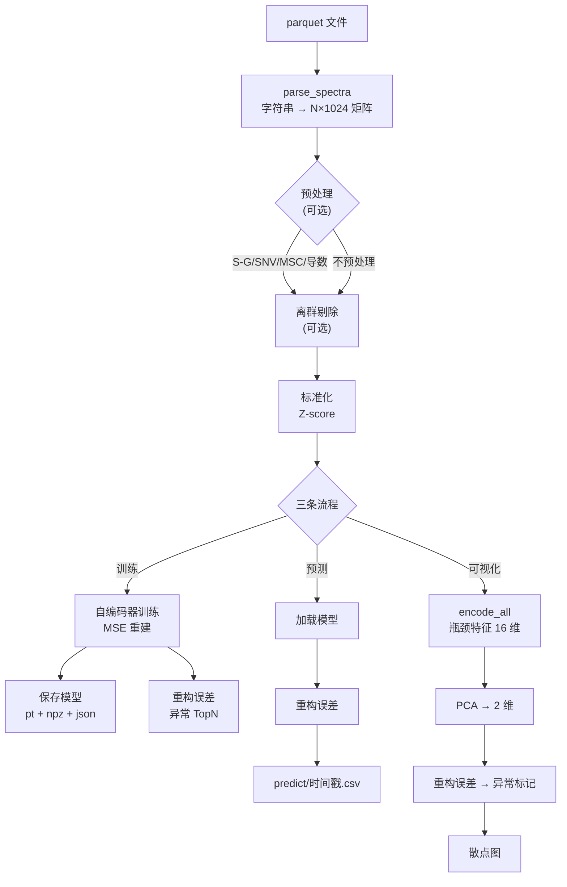
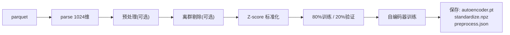
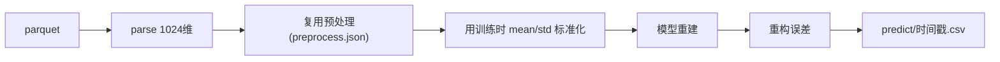
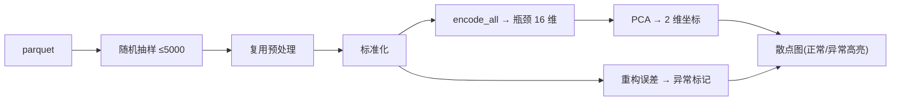

# 算法与数据流说明

本文档解释秋月梨 NIR 系统的**算法原理**、**每个数据字段的含义**，以及从原始
parquet 到最终结果的**完整数据流**。

## 1. 数据说明

数据为 parquet 格式，共 **24462 条**秋月梨样本。主要字段：

| 字段 | 维度 | 含义 | 在系统中的角色 |
| --- | --- | --- | --- |
| `SpectrumData` | 1024 | 原始光谱强度（逗号分隔字符串） | **建模输入**（默认） |
| `Abs` | 301 | 由 NIR 计算的吸光度（逗号分隔字符串） | 可选建模输入（训练页签「光谱字段」下拉框切换） |
| `SnNumber` | 1 | 样本编号 | 预测结果里用于标识样本 |
| `PredictedValue` | — | 糖度等标签 | 本系统不用于训练（无监督） |
| `Diameter` | — | 果径 | 同上 |

**关键理解**：本系统是**无监督**的，默认只用 `SpectrumData`（1024 维光谱强度）
建模，不依赖任何标签。训练页签的「光谱字段」下拉框可在 `SpectrumData` 与
`Abs`（301 维）之间切换；训练时会把所选字段写入 `spectrum_column.json`，
预测与可视化自动复用同一字段，无需手动保持一致。其他字段仅用于输出标识或参考。

## 2. 数据流全景



## 3. 算法原理

### 3.1 自编码器（Autoencoder）

对称全连接网络，结构：

```
1024 → 256 → 64 → 16(瓶颈) → 64 → 256 → 1024
└───── 编码器 ─────┘              └───── 解码器 ─────┘
```

- **编码器**：逐层压缩，把 1024 维压到 16 维瓶颈
- **瓶颈（16 维）**：网络学到的「核心特征」，是特征学习的结果
- **解码器**：逐层放大，把 16 维特征重建回 1024 维
- **激活**：隐藏层用 ReLU，输出层线性
- **损失**：均方误差 $MSE = \frac{1}{N}\sum(\hat{x}-x)^2$
- **优化器**：Adam

**训练本质**：无标签的「重建自己」。为了让重建尽量接近输入，编码器被迫提炼
出 16 维最有信息量的特征——这就是自监督预训练。

### 3.2 Z-score 标准化

逐波长（逐列）标准化：

$$
x'_{ij} = \frac{x_{ij} - \bar{x}_j}{\sigma_j}
$$

- 每个波长减去该波长的均值、除以标准差
- 意义：让 1024 个波长量纲一致，数值集中，加速收敛
- **训练时保存 mean/std，预测时用同一组参数**（保证一致）

### 3.3 光谱预处理（可选）

按固定顺序叠加：

```
S-G 平滑 → SNV → MSC → 一阶导数 → 二阶导数
```

| 方法 | 原理 | 意义 |
| --- | --- | --- |
| S-G 平滑 | 窗口内多项式拟合取中心点 | 去噪 |
| SNV | 逐样本 (x−mean)/std | 消除散射与尺度 |
| MSC | 逐样本对平均光谱线性回归校正 | 消除散射（相对参考光谱） |
| 一阶导数 | np.gradient 沿波长求导 | 消除基线偏移 |
| 二阶导数 | 求两次导 | 消除基线漂移 |

> 注意：导数会放大噪声，SNV 与 MSC 二选一即可。经验上「平滑 + SNV/MSC」最佳。

### 3.4 离群剔除（可选）

```
SNV → PCA(10 维) → KMeans(k 簇) → 簇内距离分位数剔除
```

- 先 SNV、PCA 降维去除冗余
- KMeans 聚成 k 簇（可自动选 k，用轮廓系数）
- 计算每个样本到**所属簇中心**的距离
- 距离超过分位数（默认 99%）的判为离群、剔除

**意义**：在训练前去掉异常样本，避免污染自编码器学到的特征。

### 3.5 PCA（主成分分析）

通过 SVD 把数据投影到方差最大的方向：

- 可视化流程中，把 16 维瓶颈特征降到 **2 维**
- 输出「前 2 主成分解释方差」（如 93.9%），表示 2 维保留了原数据多少信息

### 3.6 重构误差与异常检测

自编码器对「正常」样本重建得好（误差小），对「异常」样本重建得差（误差大）：

$$
err_i = \frac{1}{1024}\sum_{j}(x_{ij} - \hat{x}_{ij})^2
$$

- **阈值**：重构误差的百分位数（默认 99 分位）
- **判定**：$err_i > 阈值$ 即判为异常
- **TopN**：误差最大的 n 个样本是「最可疑」的对象

## 4. 三条流程详解

### 4.1 训练流程



产出（存到 `model_output/时间戳/`）：

| 文件 | 内容 |
| --- | --- |
| `autoencoder.pt` | 模型权重 |
| `standardize.npz` | 标准化的 mean、std |
| `preprocess.json` | 预处理配置（预测/可视化复用） |
| `reconstruction_error.csv` | 训练数据的重构误差 |

### 4.2 预测流程



输出 CSV：`SnNumber` + `reconstruction_error`，即每个样本的异常分数。

### 4.3 可视化流程



- 全量加载样本（2D 用 `QScatterSeries`、3D 用自定义 OpenGL 点云，均可承载 2.4 万+ 点）
- 瓶颈特征 PCA 到 2 维，画出分布
- 异常样本（重构误差超阈值）用红色大点高亮
- 支持切换 **3D**：PCA 到 3 维，用 OpenGL 点云展示前 3 个主成分（解释方差更高，如 92.5%），可旋转、缩放从任意角度观察

### 4.4 如何解读 2D 散点图

#### 图的构成

| 元素 | 含义 |
| --- | --- |
| 横轴（PC1） | 第一主成分：样本差异**最大**的方向 |
| 纵轴（PC2） | 第二主成分：差异**第二大**的方向 |
| 每个点 | 一个秋月梨样本 |
| 金色小点 | 正常样本 |
| 红色大点 | 异常样本（重构误差超阈值） |

> 点的坐标 = 该样本的 16 维瓶颈特征经 PCA 投影到 2 维后的位置。
> 「PCA 前 2 主成分解释方差」表示这张 2D 图保留了原数据多少信息（如 86.9% ≈ 保留了约 87%）。

#### 怎么看

1. **看有几团**：点聚成几簇，说明数据大致分成几类。例如聚成 2 团，可能对应两个批次/品种/成熟度。
2. **看团的大小与疏密**：团越大越密，说明这一类样本越多、越一致。
3. **看团之间的距离**：两团离得越远，说明它们光谱差异越大。
4. **看散落在外的点**：孤零零落在各团之外的点，往往是离群或异常样本。
5. **看红色点的位置**：异常样本大多分布在图的边缘或稀疏地带（但也可能藏在团内部，见注意事项）。

#### 有什么用

1. **一眼看全局结构**：不用理解 1024 维光谱，2D 图直接展示「这些梨大体分几类、各类关系如何」。
2. **发现异常样本**：红色大点就是模型认为最可疑的样本，可以直接溯源到 `SnNumber`。
3. **验证模型是否合理**：
   - 健康的表现：正常样本（金色）聚成清晰团块，异常（红色）稀疏地分布在边缘/外部
   - 异常的表现：金色点乱成一锅粥、没有明显簇结构 → 说明特征没学好，或预处理不合适
4. **辅助调参**：如果发现某个预处理后图变得更聚拢、团块更清晰，说明那个预处理有效。

#### 注意事项

- **PCA 会丢信息**：2D 只保留前 2 个主成分（约 87% 信息），两个点在图上看很近，在高维空间未必真的相似。
- **异常不一定都在边缘**：有些异常样本藏在正常团内部（光谱大体正常、但某个局部波段异常导致重建差），它们可能混在金色点中，要结合重构误差数值判断。
- **全量加载**：「最大样本数」默认 5000，调大即可加载全部样本（2D/3D 均支持全量，GPU 点云渲染 2.4 万点无压力）。

## 5. 一句话总结数据流

```
原始光谱(1024) → [预处理] → [离群剔除] → 标准化
    → 自编码器压缩到 16 维特征 → 重建回 1024 维
    → 重建误差 = 异常分数
    → 特征 PCA 到 2 维 = 可视化
```
