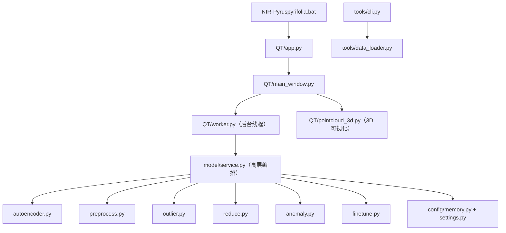

# 项目结构

本文档说明「秋月梨 NIR 近红外光谱分析系统」的目录结构、各模块职责与调用关系。

## 一、目录结构

```
NIR-Pyruspyrifolia/
├── config/                  # 配置层
│   ├── settings.py          # 项目根目录、数据目录、日志目录、配置文件路径
│   ├── memory.py            # AppMemory：配置记忆（JSON 持久化窗口位置/历史路径）
│   └── app_config.json      # 运行时生成的配置记忆文件
├── data/                    # 数据层
│   ├── 秋月梨光谱数据含RealValue-解密.xlsx    # 原始 Excel（宽表，16 个列块）
│   ├── 秋月梨光谱数据_RealValue_sample.csv   # 转换后两列：RealValue + sample
│   └── 秋月梨光谱数据_RealValue.parquet      # 微调用：RealValue + SpectrumData
├── model/                   # 算法核心层（纯计算，不依赖界面）
│   ├── autoencoder.py       # 自编码器网络、自监督训练、特征提取、重建误差
│   ├── preprocess.py        # 光谱预处理：SNV / MSC / S-G 平滑 / 一阶二阶导数
│   ├── outlier.py           # 训练前离群剔除：SNV→PCA→KMeans→距离分位数
│   ├── reduce.py            # PCA 降维（SVD 实现）
│   ├── anomaly.py           # 异常检测：重构误差分位数阈值 + TopN
│   ├── finetune.py          # 有监督微调：回归头、两阶段训练、评估指标
│   └── service.py           # 高层编排：run_training / run_prediction / run_visualize /
│                            #            run_finetune / run_finetune_predict
├── QT/                      # 界面层（PySide6）
│   ├── app.py               # GUI 入口（pythonw 启动）
│   ├── main_window.py       # 主窗口，8 个页签
│   ├── worker.py            # ModelWorker：后台线程 + 信号（日志/进度/完成/错误）
│   ├── pointcloud_3d.py     # 自定义 OpenGL 3D 点云渲染（替代 Q3DScatter）
│   └── theme.py             # 秋月梨主题样式
├── tools/                   # 工具层
│   ├── cli.py               # 命令行入口（识别并解析 parquet）
│   ├── data_loader.py       # parquet 解析（is_parquet/read_parquet/schema/metadata）
│   ├── convert_xlsx_to_csv.py  # Excel 宽表 → 两列 CSV
│   ├── cluster_baseline.py  # NIR 无监督聚类基线（numpy 实现）
│   ├── check_domain_shift.py  # 分布核查命令行（委托 model/domain_shift.py）
│   ├── autoencoder.py       # 早期自编码器脚本（已并入 model/autoencoder.py）
│   └── logger.py            # 运行日志（滚动）+ 崩溃日志 + 全局异常钩子
├── model_output/            # 自监督训练输出（按 YYYYMMDD_HHMMSS 建子目录）
├── finetune_output/         # 微调输出（按 YYYYMMDD_HHMMSS 建子目录）
├── predict/                 # 预测结果（按 YYYYMMDD_HHMMSS[_finetune] 建子目录，含 CSV 与图）
├── log/                     # 运行日志（app_YYYY-MM-DD.log）
├── runtime/                 # 便携 Python 运行时（含 torch CUDA 等全部依赖，离线可用）
├── md/                      # 文档
├── NIR-Pyruspyrifolia.bat   # 一键启动脚本（自动定位 runtime\pythonw.exe）
├── requirements.txt         # 依赖清单
└── README.md                # 项目说明
```

## 二、模块职责

| 模块 | 文件 | 职责 |
| --- | --- | --- |
| 配置 | `config/settings.py` | 定义项目根、数据目录、日志目录、配置文件路径 |
| 配置 | `config/memory.py` | `AppMemory`：JSON 读写窗口位置、最近路径、训练参数 |
| 数据 | `tools/data_loader.py` | parquet 识别、元信息、光谱解析 |
| 数据 | `tools/convert_xlsx_to_csv.py` | Excel 多列块宽表 → 两列 CSV |
| 算法 | `model/autoencoder.py` | 自编码器 + 自监督训练 + 特征提取 + 重建误差 |
| 算法 | `model/preprocess.py` | 光谱预处理 |
| 算法 | `model/outlier.py` | 离群剔除 |
| 算法 | `model/reduce.py` | PCA |
| 算法 | `model/anomaly.py` | 异常检测 |
| 算法 | `model/finetune.py` | 有监督微调 |
| 算法 | `model/domain_shift.py` | 分布一致性核查（6 项域偏移检测） |
| 算法 | `model/data_analysis.py` | 多批数据分析（分布/异常/相似性） |
| 编排 | `model/service.py` | 把各算法编排成训练/预测/可视化/微调四个高层接口 |
| 界面 | `QT/main_window.py` | 8 页签主窗口 |
| 后台 | `QT/worker.py` | 后台线程，信号回传 |
| 渲染 | `QT/pointcloud_3d.py` | OpenGL 3D 点云 |
| 入口 | `QT/app.py`、`tools/cli.py`、`.bat` | GUI / 命令行 / 一键启动 |

## 三、调用关系



## 四、八个页签

| 页签 | 对应服务 | 说明 |
| --- | --- | --- |
| 数据预览 | `tools/data_loader.py` | 打开 parquet、表格预览、缩放、导出 CSV |
| 自监督预训练 | `run_training` | 无标签训练自编码器，实时损失曲线，支持暂停 |
| 模型预测 | `run_prediction` | 异常检测，输出重构误差 |
| 模型微调 | `run_finetune` / `run_finetune_predict` | 有标签微调 + 预测评估 |
| 降维可视化 | `run_visualize` | PCA 2D/3D 散点 + 异常高亮 |
| 分布核查 | `run_domain_shift` | 核查预训练与标签样本分布一致性 |
| 数据分析 | `run_data_analysis` | 多批数据的分布/异常/相似性分析 |
| 帮助 | — | 内嵌帮助文本 |

## 五、数据流总览

```
parquet/xlsx 原始数据
   │  ① 解析（tools/data_loader.py / convert_xlsx_to_csv.py）
   ▼
1024 维光谱矩阵 + 可选标签
   │  ② 预处理（可选 SNV/MSC/S-G/导数）
   ▼
[离群剔除（可选）] → [标准化 z-score]
   │
   ├─③ 自监督训练 → 自编码器 → model_output/
   ├─④ 异常检测/预测 → 重构误差 → predict/
   ├─⑤ 微调 → 回归头 + 编码器 → finetune_output/
   ├─⑥ 降维可视化 → PCA 2D/3D 散点
   ├─⑦ 分布核查 → 6 项域偏移指标 + 对比图
   └─⑧ 数据分析 → 多批分布/异常/相似性报告
```

详细原理、公式与参数见：
- 《无监督学习》——自编码器、异常检测、降维可视化
- 《数据预处理》——SNV/MSC/S-G/导数与离群剔除
- 《模型微调》——有监督微调与评估
- 《算法与数据流》——字段含义与端到端数据流
